# Summarization with Graphical Elements

<i> This repository accompanies our paper: </i>

Maartje ter Hoeve, Julia Kiseleva, Maarten de Rijke. [Automatic Summarization with Graphical Elements](https://arxiv.org/pdf/2204.07551.pdf). 

If you are interested in ```GraphelSums```, the human-labeled dataset that we collected as part of this work, have a look at [this repository](https://github.com/maartjeth/GraphelSums).


## Table of contents

1. [Introduction](#introduction)
2. [First Proof-of-Concept Human Evaluation](#first-proof-of-concept-human-evaluation)
3. [Baselines](#baselines)
4. [Human Evaluation Baselines](#human-evaluation-baselines)
5. [BibTex](#bibtex)

## Introduction

This paper is part of our efforts to expand the types of automatic summaries that we can create. That is, the vast majority of automatic summarization research is focused on generating summaries in the form of a few lines of text. While successful and useful, this is certainly not the only way to generate summaries. Different users of automatically generated summaries are probably interested in different types of summaries. 

We started to explore this question in our [2022 NAACL paper](https://aclanthology.org/2022.naacl-main.4.pdf), where we developed a survey to study the needs of users of automatically generated summaries. We also found that participants of our survey indicated a whole range of different needs for automatically generated summaries. Pretty exciting, as now we have a full range of new research projects at our disposal! One of these directions is being able to generate summaries with graphical elements, such as arrows, or colored text. These are the types of summaries that we discuss in the paper that is associated with this repository: [Automatic Summarization with Graphical Elements](https://arxiv.org/pdf/2204.07551.pdf)


## First Proof-of-Concept Human Evaluation

In our work, we first evaluate our task design with a proof-of-concept human evaluation. Here we share some additional details of this human evaluation.

Below, you first find some screenshots of the task. Because these are screenshots, the font size is not equal among them (the summaries are a bit smaller than in the actual task).

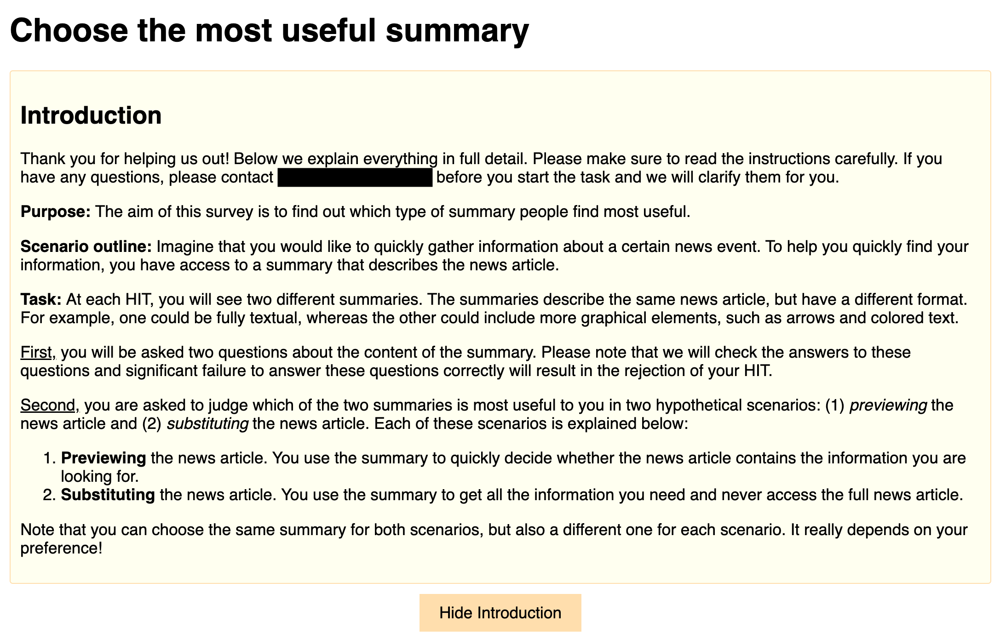
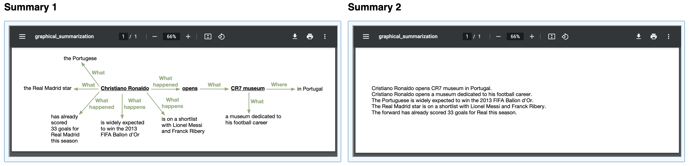
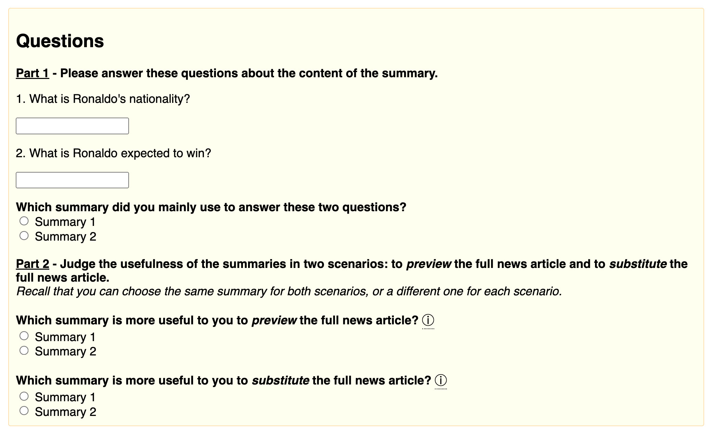

The control questions that we used were (please refer to the [paper](https://arxiv.org/pdf/2204.07551.pdf) for more details about why and how we use these control questions):

<i> Document 1: </i>

* How expensive was the replica of the ark?
* What is the name of the carpenter?
* Where is the replica of the ark?
* How long did Johan Huyberts spend on building the ark?
* What did the carpenter dream?
* What can visitors do in the ark?

<i> Document 2: </i>

* What is Ronaldo's nationality?
* What is Ronaldo expected to win?
* Where did Ronaldo open a museum?
* How many goals has Ronaldo scored for Real Madrid this season?
* What is the CR7 museum?
* Who are on the short list together with Ronaldo?*

## Baselines

In our work we also run a couple of baselines, to get an understanding of the difficulty of the task. Currently, these baselines consist of an abstractive summarization component, and a relation extraction component. Please refer to the [paper](https://arxiv.org/pdf/2204.07551.pdf) for a detailed written explanation of each of these steps.

You can find the requirements in the ```./requirements.txt``` and you can install them in a new Python environment by:

```
pip install -r ./requirements.txt
```

### 1) Summarization Step

For the summarization step we finetuned the BART and T5 implementations from
the [HuggingFace Transformer Library](https://github.com/huggingface/transformers). Example code can be
found [here](https://github.com/huggingface/transformers/blob/main/examples/pytorch/summarization/README.md).

### 2) Relation Extraction Step

* <i>Snorkel</i>. The entire pipeline to obtain the Snorkel labels can be found in ```./snorkel-labels/main.py```. All labeling functions can be found in ```./snorkel-labels/relation_extraction.py```. 

Usage:

```
python3 ./snorkel-labels/main.py <--your_arguments>
```

You can choose what parts of the labeling pipeline to run, by adding each of the flags for these steps. For example, if you want to run the NLP pipeline, you add ```--run_nlp_pipeline```, etc. Have a look at ```./snorkel-labels/main.py``` for all the flags you can add. Each next step is dependent on the previous steps, but once you have run and saved a previous step, you do not have to repeat it if you want to run one of the next steps again. Update the arguments with your own filenames.

* <i> DyGIE++</i>. We used the code as published in the official repository [here](https://github.com/dwadden/dygiepp). We used training scripts as given in [this folder](https://github.com/dwadden/dygiepp/tree/master/training_config) (adapting the path names). As stated in our paper, we adapt treat summary abstracts as if they were a single sentence, to match the format (as suggested in the DyGIE++ repository).

## Human Evaluation Baselines

We ran a human evaluation to evaluate the baselines. Specifically, we were interested in which of a pair of summaries people found most useful for a task. In the [paper](https://arxiv.org/pdf/2204.07551.pdf) we give further details about this task, here we share some screenshots to accompany our explanation in the paper. Just like before, because these are screenshots, the size ratio is sometimes a bit different from the actual task (for example, the font size of the summaries appears a bit smaller in this example than in the actual task).


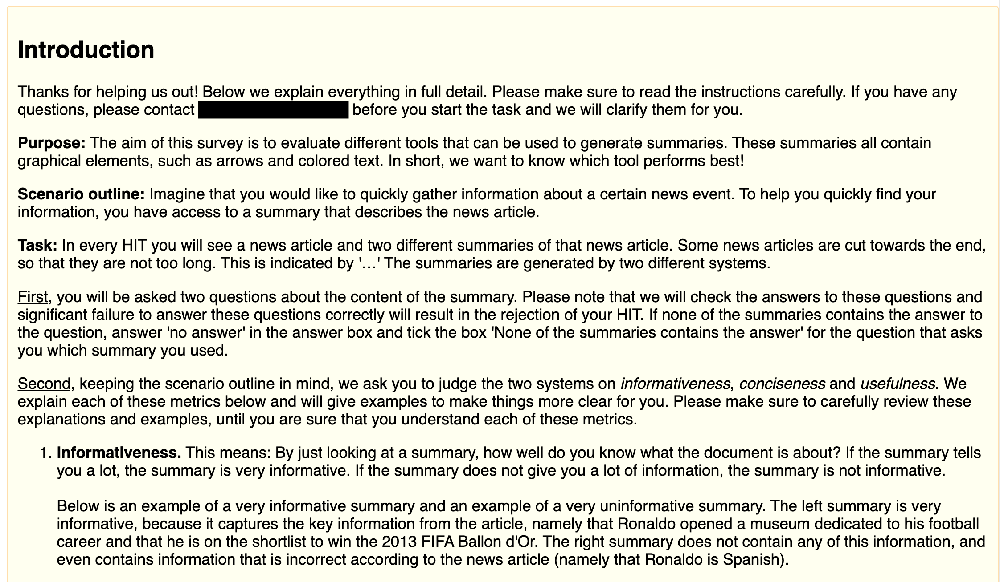
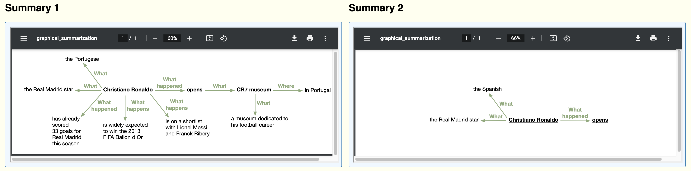
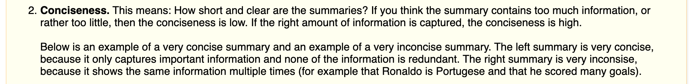
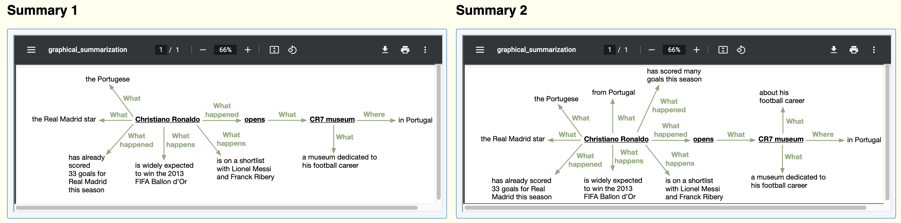
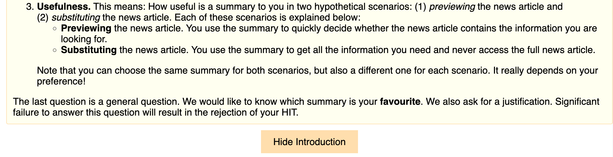
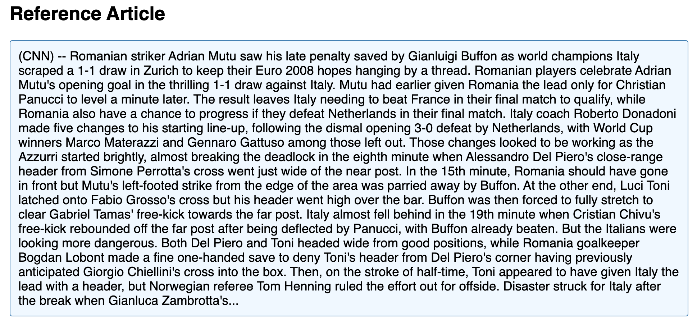
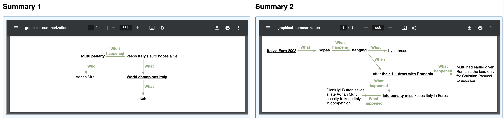
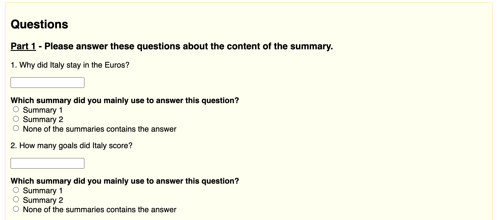
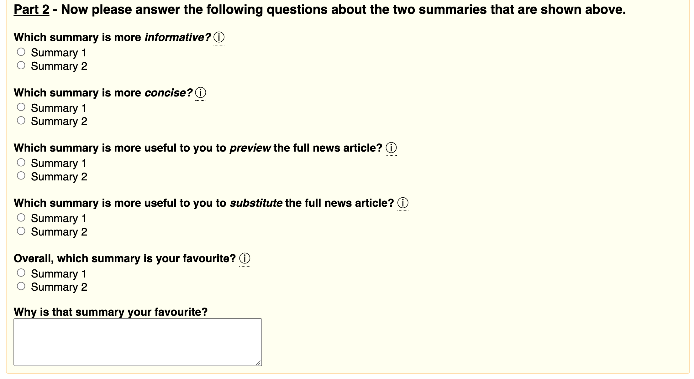

## BibTex

If you are using this work, please cite:

```
@article{ter2022summarization,
  title={Summarization with Graphical Elements},
  author={ter Hoeve, Maartje and Kiseleva, Julia and de Rijke, Maarten},
  journal={arXiv preprint arXiv:2204.07551},
  year={2022}
}
```

The BibTex for our NAACL paper is:

```
@inproceedings{ter-hoeve-etal-2022-makes,
    title = "What Makes a Good and Useful Summary? {I}ncorporating Users in Automatic Summarization Research",
    author = "Ter Hoeve, Maartje  and
      Kiseleva, Julia  and
      Rijke, Maarten",
    booktitle = "Proceedings of the 2022 Conference of the North American Chapter of the Association for Computational Linguistics: Human Language Technologies",
    month = jul,
    year = "2022",
    address = "Seattle, United States",
    publisher = "Association for Computational Linguistics",
    url = "https://aclanthology.org/2022.naacl-main.4",
    doi = "10.18653/v1/2022.naacl-main.4",
    pages = "46--75",
}
```